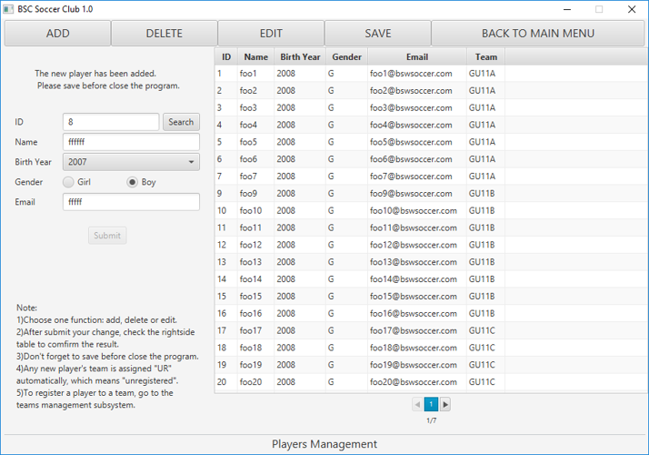
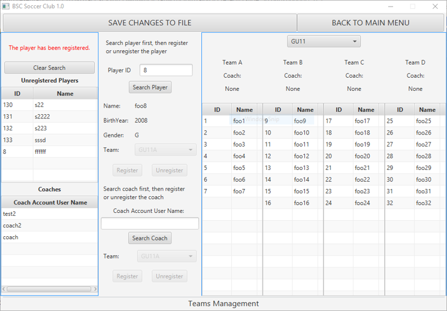
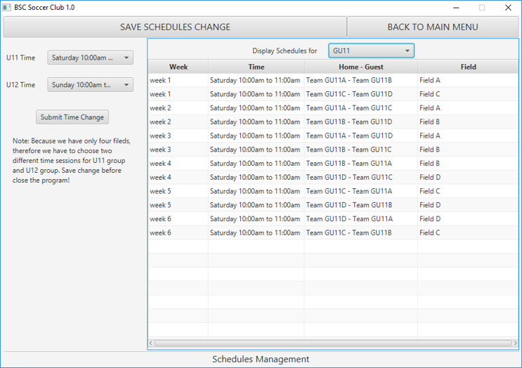
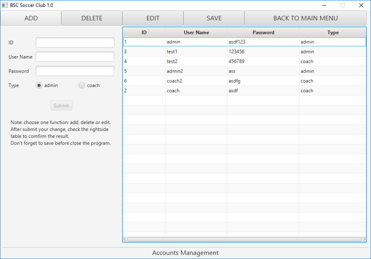
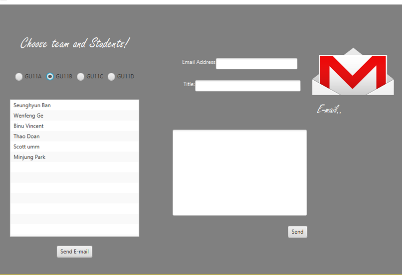
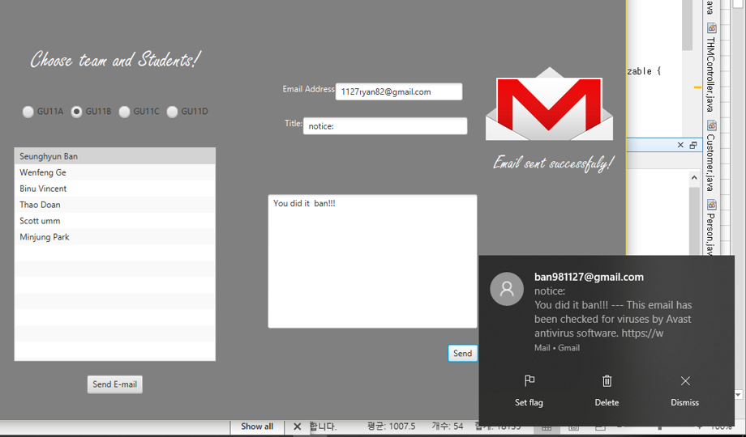

<b>Systems login:</b> 
1)accData.csv: accounts data used to login are saved in this file.(format: id,username,password,type) 
&nbsp;Examples: 
  &nbsp;&nbsp; 1,admin,asdf123,admin <-username:admin;password:asdf123;can be used to login to Admin system; 
  &nbsp;&nbsp; 2,coach,binu,coach <-username:coach;password:binu;can be used to login to Coach system; 
  
<b>Admin system:</b>  
(After clicking "save" in each screen, the corresponding data changes will be saved to data file)  
    2) In Admin system main menu, you can choose one of four functions 
    
2.1)players: to display, add, delete, or edit player information  
1. Player's team information cannot be changed here  
2. We have teams management to register or unregister a player to a team 
3. Any new player will be assigned "UR" team which means unregistered to any team 
4. Player's birthyear and gender cannot be edited instead you can delete then add a pleayer if you want to modify the birthyear or gender but this means the player will be removed from the current team and become "UR"  

2.2)teams:  to display member list of each team and register a player to a team or unregister a player from current team 
1. First step is to search a player by id 
2. If the player is unregistered, now the textfield is locked and the combobox give the potential teams choices according to the player's age and gender 
3. Also provide the demo function to register or unregister a coach(represented by a coach account  

2.3)schedules: to display and change the time for matches schedules  

2.4)accounts: to add,delete or edit accounts information 
1. The id and usernames are required to be unique 
2. In "edit" mode, you can only change the password  

<b>Coach system:</b> 
 Click user namme and send a email 

<b>Login Page</b> 
 

<b>Player Page</b> 
 

<b>Teams Page</b> 
 

<b>Schedule Page</b> 
 

<b>Account Page</b> 
 

<b>Coach Page_email</b> 
 

<b>Success_email</b> 
 
